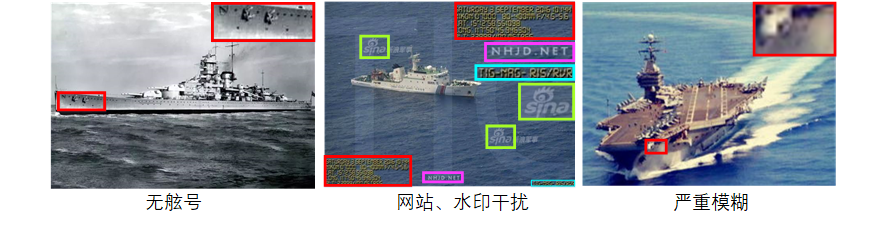
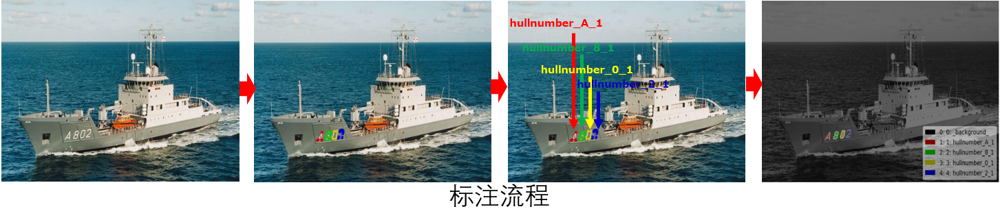

随着日趋复杂的海洋权益保护行动的进行，海面态势感知显得尤为重要，舰船舷号识别就是其关键技术之一，然而目前没有公开数据提供支持，主要由于（1）舰船舷号属于海洋领域相关内容，获取难度较大；（2）当前相关的自然场景文本数据集均与舰船舷号数据存在较大偏差，很难泛化到舰船舷号识别任务中；（3）对舰船舷号识别研究的人还不多，相关数据相对不多。为此，本文构建了一个真实场景下的稀疏舰船舷号数据集(sparse ship hull number dataset in real scene，SSHN-RS)，包含3004张舰船图像，共计11328个舷号字符，覆盖了多国、各类、水平、倾斜、简单背景、复杂背景、光线不佳和被遮挡等多样且复杂的舰船舷号，是一个具有挑战性的数据集。下列为SSHN-RS多样性文本样例：

SSHN-RS数据库构建主要分为如下步骤：
1.数据采集和处理：本文从互联网视觉数据库中进行了数据采集，但在数据采集的过程中遇到了很多问题：(1)部分舰船图像不包含舷号文本；(2)多数图片含有水印和网站等干扰噪声；(3)较多图片像素过低，舷号极度模糊，如下图所示。因此为了确保数据质量，本文通过手动调整的方式对收集的数据进行了精细筛选，主要剔除不含舷号和像素过低的图像，并去除干扰噪声。

2.数据标注：按照COCO数据集的格式进行标注。使用开源标注工具LabelMe对36个舰船舷号子类进行语义标注，标注方式为人工标记，标注结果保存文件为json格式。如下图所示。

如果需要进行相关研究，请联系：cbcbingchuan@sina.com

